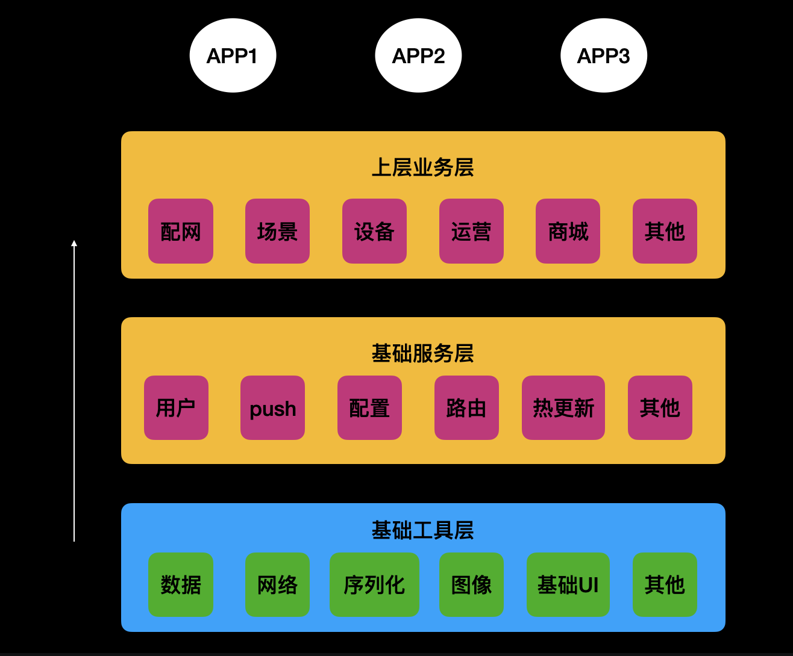
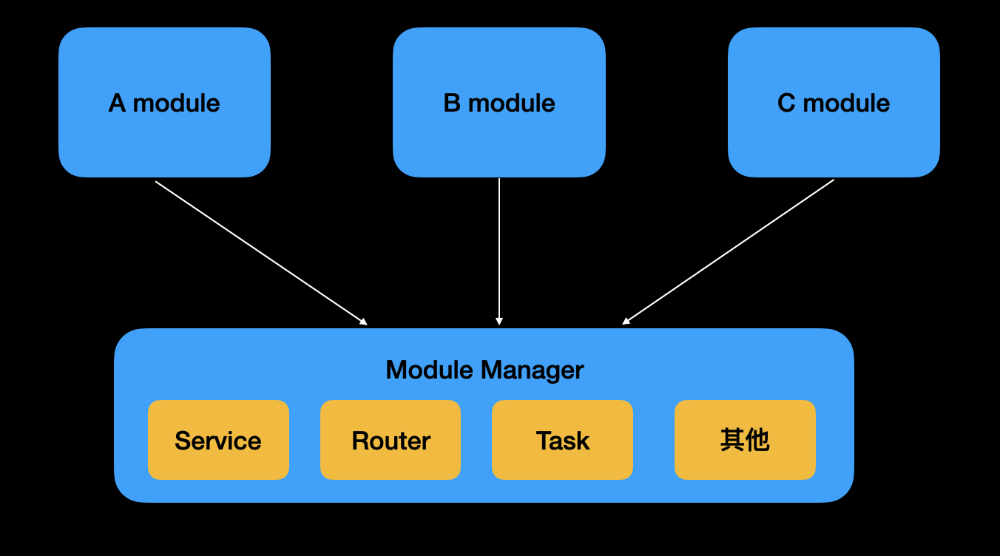

# JDModuleManager

[](https://travis-ci.org/Hello-World/JDModuleManager)
[](https://cocoapods.org/pods/JDModuleManager)
[](https://cocoapods.org/pods/JDModuleManager)
[](https://cocoapods.org/pods/JDModuleManager)

## 组建解偶

### 基本分层：

1. 基础工具层： 

   包括一些数据，网络，序列化，图像， 定位， 基础UI等等工具层， 这一层各个组件基本独立存在，只可被上层依赖

2. 基础服务层： 

   上层各个业务，或者每个APP都需要的基础服务，会下沉到这一层

3. 业务层：
	
	 由各个业务组维护的彼此独立的业务；



### 解偶

基础服务层，业务层的依赖需要解偶




这里有个解偶组建Module Manager

1. Router 处理页面路由，deep link，web跨平台跳转
2. Service 接口
3. Task 模块启动服务， 提供服务队列来初始化

## 使用

1. 定义一个模块

实现JDModuleRegisterProtocol协议
* 注册路由
* 注册方法
* 注册启动任务

```objc
@interface SomeModuleDemoImpl : NSObject<JDModuleRegisterProtocol>
@end

/** 注册路由
   定义好路由 kSomeRouter1, kSomeRouter1 实现registModuleRoutes方法，即可注册好对应的路由
   @return 路由数组
*/
- (NSArray<NSString *> *)registModuleRoutes {
    return @[kSomeRouter1, kSomeRouter2];
}

/** 路由调用
   定义好路由 会通过实现handleRouteWithScheme:host:path:params:方法, 来自定义跳转
   @params scheme
   @params host
   @params path
   @params params
   @return BOOL 
*/
- (BOOL)handleRouteWithScheme:(NSString *)scheme
                         host:(NSString *)host
                         path:(NSString *)path
                       params:(NSDictionary *)params {
    NSString *router = [NSString stringWithFormat:@"%@://%@", scheme, host];
    if ([router isEqualToString:kARouter1]) {
        NSLog(@"kARouter1");
    } else if ([router isEqualToString:kARouter2]) {
        NSLog(@"kARouter2");
    }
    return YES;
}

/** 
 定义接口协议
 @return 接口数组
*/
- (NSArray<JDModuleServiceInfo *> *)registModuleServices {
    JDModuleServiceInfo *info = [JDModuleServiceInfo new];
    info.protocol = @protocol(AModuleServiceProtocol);
    info.implClass = AModuleDemo.class;
    
    return @[info];
}

/**
 定义启动task
 @return 启动任务类
*/
- (NSArray<Class<JDLaunchTaskProtocol>> *)registLaunchTasks {
    return @[[AModuleTask class]];
}
```


## Example

JDModule Show为demo其中

```yaml
├── JDModuleShow.xcworkspace
├── JDModuleShow.xcodeproj
├── AppDelegate.m
├── AModule
|   ├── AModuleDemo
├── BModule
|   ├── BModuleDemo
|   ├── BModuleTask
├── Router
|   ├── Router.h
├── Service
|   ├── AmoduleProtocol
|   ├── BmoduleProtocol
├── Pods
└── podfile
└── podfile.lock
```


Amodule, Bmodule 表示2个独立模块

Router.h 管理路由

Service 下面管理模块服务


## Requirements

## Installation

JDModuleManager is available through [CocoaPods](https://cocoapods.org). To install
it, simply add the following line to your Podfile:

```ruby
pod 'JDModuleManager'
```

## Author

Hello-World, jackincitibank@gmail.com

## License

JDModuleManager is available under the MIT license. See the LICENSE file for more info.
